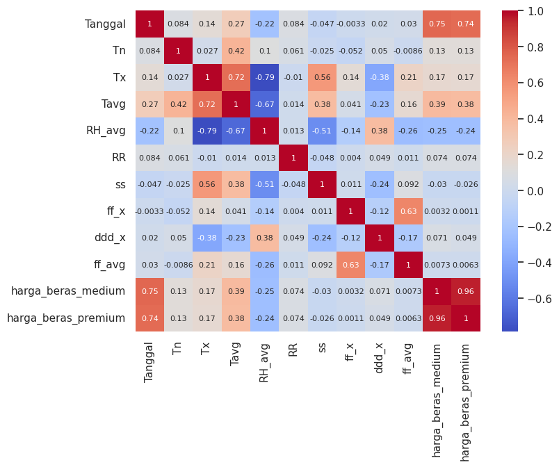
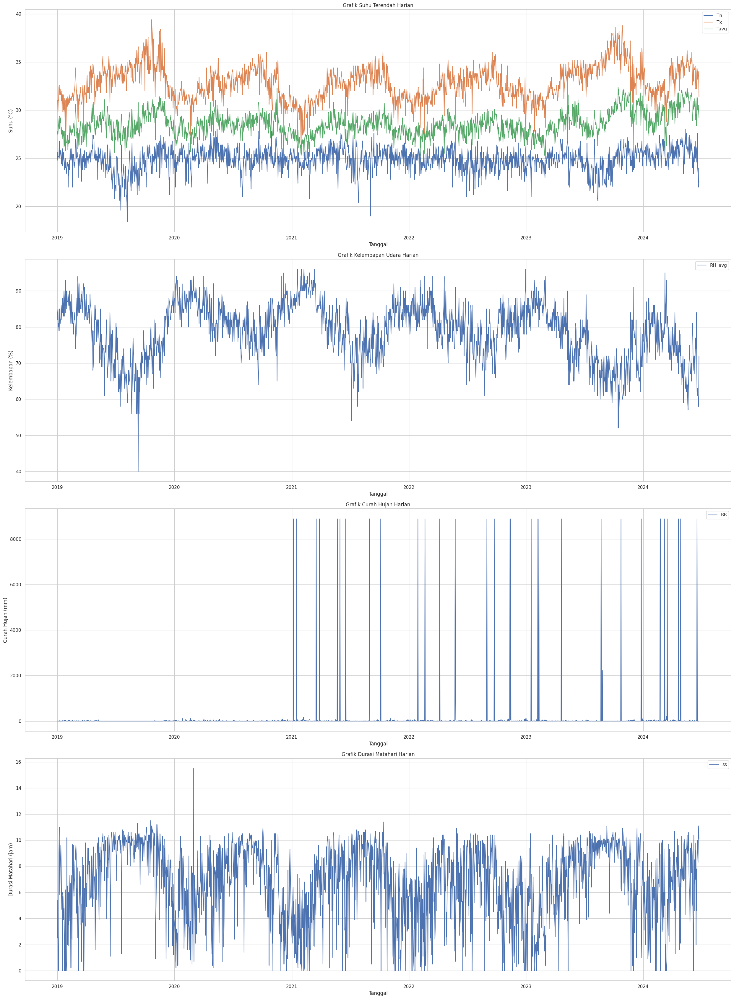
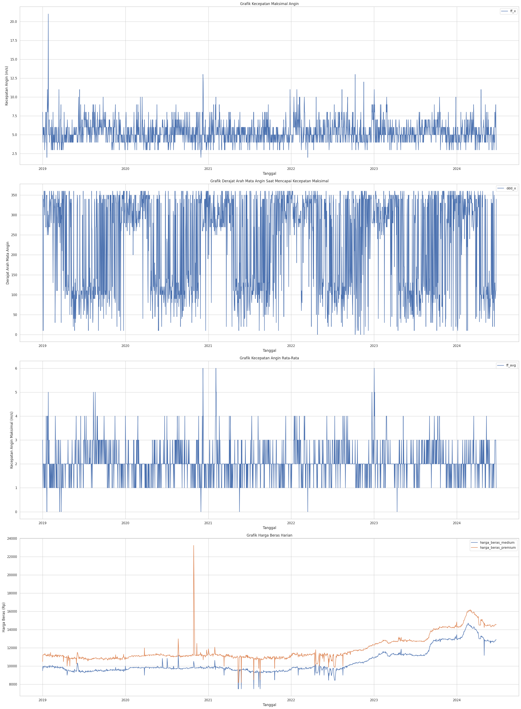
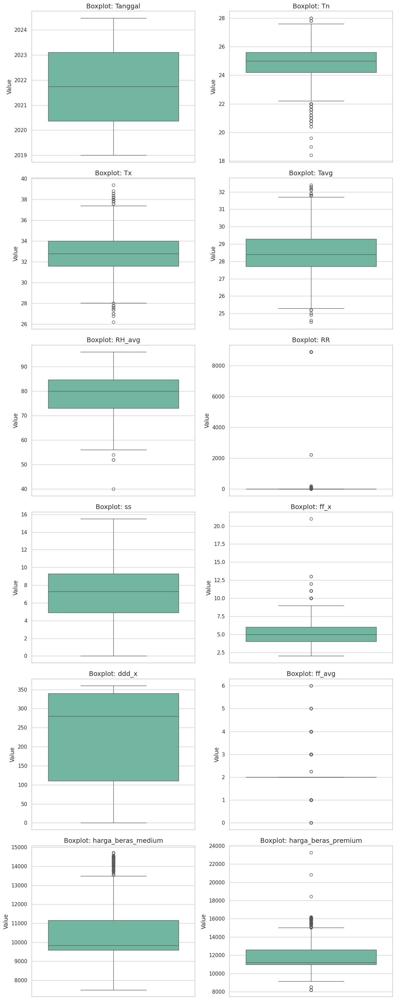
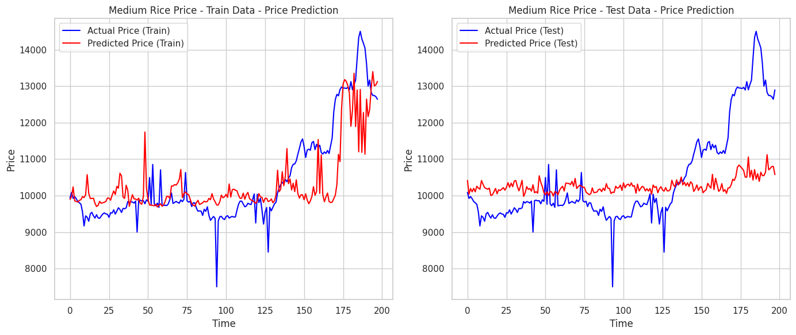
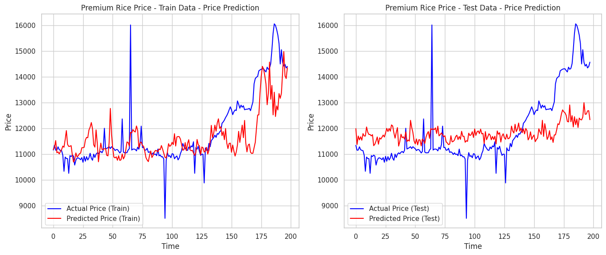

# Rice Price Prediction using LSTM

## Project Overview
This project implements a Long Short-Term Memory (LSTM) neural network to predict rice prices based on weather conditions. The model predicts both medium and premium rice prices using various meteorological features.

## Dataset
The dataset contains daily weather measurements and rice prices with the following features:
- **Weather Features:**
  - `Tn`: Minimum temperature
  - `Tx`: Maximum temperature
  - `Tavg`: Average temperature
  - `RH_avg`: Air humidity
  - `RR`: Rainfall
  - `ss`: Sunshine duration
  - `ff_x`: Maximum wind speed (dropped)
  - `ddd_x`: Wind direction degrees (dropped)
  - `ff_avg`: Average wind speed (dropped)

- **Target Variables:**
  - `harga_beras_medium`: Medium rice price
  - `harga_beras_premium`: Premium rice price

## Feature Selection

Based on correlation analysis:
- Wind-related features (`ff_x`, `ddd_x`, `ff_avg`) were dropped due to near-zero correlation with other features and target variables
- Final features used for modeling:
  - Minimum temperature (`Tn`)
  - Maximum temperature (`Tx`)
  - Average temperature (`Tavg`)
  - Air humidity (`RH_avg`)
  - Rainfall (`RR`)
  - Sunshine duration (`ss`)

## Data Analysis and Visualization
Initial data visualization was performed for each feature to identify patterns and anomalies:
- Created time series plots for all features using matplotlib
- Used subplots to visualize:
  - Temperature measurements (Tn, Tx, Tavg)
  - Air humidity (RH_avg)
  - Rainfall (RR)
  - Sunshine duration (ss)
  - Wind measurements (ff_x, ddd_x, ff_avg)
  - Rice prices (medium and premium)

### Identified Anomalies
Through visualization, several data quality issues were discovered:
1. Rainfall (RR):
   - Contained extreme outlier value of 8888
   - Physically impossible for daily rainfall

2. Sunshine Duration (ss):
   - Some values exceeded 12 hours
   - Physically impossible in a 24-hour day

3. Rice Prices:
   - Contained values below 8000 and above 20000
   - These values were identified as potential outliers based on market knowledge

## Data Preprocessing
Based on the identified anomalies, the following preprocessing steps were implemented:
1. **Missing Value Treatment:**
   - Applied rolling mean with a window size of 5 to fill missing values
   - Used linear interpolation for remaining gaps

2. **Outlier Handling:**
 
   - Based on the boxplot, it shows that some of the features have outliers especially the target features
   - Implemented IQR method with 2.5 * IQR bounds
   - Special handling for sunshine duration (capped at 12 hours)
   - Replaced outliers with rolling window means

3. **Feature Scaling:**
   - Applied MinMaxScaler to normalize features and target variables
   - Scaled all values to range [0, 1]

1. **Missing Value Treatment:**
   - Applied rolling mean with a window size of 5 to fill missing values
   - Rolling window approach chosen to maintain temporal patterns in the data
   - Used linear interpolation for any remaining gaps

2. **Outlier Handling:**
   - Implemented IQR method with 2.5 * IQR bounds to identify outliers
   - Special handling for sunshine duration:
     - Hard cap at 12 hours (physical maximum)
     - Values exceeding 12 hours replaced with rolling mean
   - For other features:
     - Values outside IQR bounds replaced with rolling window means
     - Window size of 5 days chosen to maintain local trends

3. **Feature Scaling:**
   - Applied MinMaxScaler to normalize features and target variables
   - Scaled all values to range [0, 1]

4. **Feature Selection:**
   - Based on correlation analysis, wind-related features (ff_x, ddd_x, ff_avg) were dropped
   - Final feature set includes only weather parameters with meaningful correlations to rice prices

## Model Architecture
The LSTM model consists of:
- Input layer matching feature dimensions
- First LSTM layer: 64 units with L2 regularization
- Second LSTM layer: 32 units with L2 regularization
- Dense layer: 32 units with ReLU activation
- Output layer: 1 unit (price prediction)
- Dropout layers (0.2) after each main layer to prevent overfitting

## Training Methodology
- **Rolling Window Approach:**
  - Training window size: 20 days
  - Prediction step: 10 days
  - Sequential window sliding for continuous prediction

- **Training Parameters:**
  - Optimizer: Adam
  - Loss function: Mean Squared Error
  - Batch size: 16
  - Epochs: 50

## Results  
The model's performance is evaluated using Root Mean Squared Error (RMSE):  

### Medium Rice Price  
- **Train Score:** 852.83  
- **Test Score:** 1208.01  

### Premium Rice Price  
- **Train Score:** 981.66  
- **Test Score:** 1201.92  

## Results Visualization

### Model Performance Analysis
Based on the visualization results:
1. **Trend Tracking:**
   - The predicted prices generally follow the overall trend of actual prices, especially in the training data.
   - In the test data, the predicted prices are relatively stable but fail to capture sharp fluctuations, especially extreme peaks and drops.

2. **Overfitting Concern:**
   - The training set shows a close match between actual and predicted prices, indicating effective learning.
   - However, in the test set, the predictions appear smoother, missing some significant variations, suggesting a potential overfitting issue.

3. **Performance in Volatile Periods:**
   - During sudden price spikes or drops, the LSTM model struggles to capture these changes in both training and test datasets.
   - This could indicate the need for hyperparameter tuning, additional relevant features (e.g., external economic indicators), or model enhancements (e.g., bidirectional LSTM, attention mechanisms).

## Dependencies
- Python 3.x
- TensorFlow
- Pandas
- NumPy
- Matplotlib
- Seaborn
- Scikit-learn

## About the Project
This project was initially developed for **GEMASTIK XVI**. Big thanks to my teammate, [Fadhil](https://github.com/dhiiil), who helped gather the dataset. The weather dataset comes from **BMKG**, and the rice price data is sourced from **PIPHN**.  

However, the remaining steps—**preprocessing, modeling, and part of the visualization**—were entirely built by myself and are completely different from the competition's original approach.
